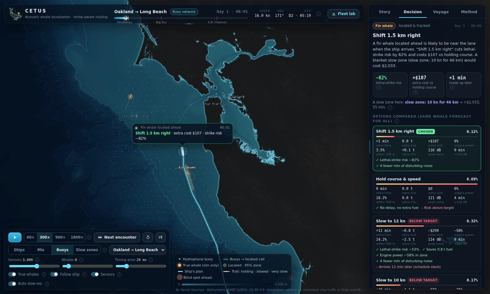
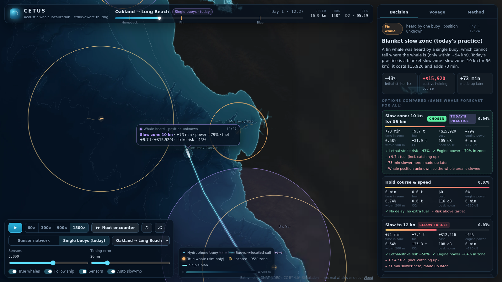

# Cetus: hear the whale, locate it, route around it

**A transparent simulation of whale-aware ship routing off California.** A network of low-cost hydrophone buoys
hears whale calls and locates each whale from tiny differences in arrival time. A Kalman filter forecasts where
the whale will be when the ship arrives. A decision engine then compares slowing down, shifting course and
today's practice, and shows the strike risk, noise, time, fuel, dollars and CO₂ for each option.



> **Live demo:** `https://<your-username>.github.io/cetus/` (see [Deploy](#deploy-free)). You can also open
> `dist/index.html` straight from disk; it is one self-contained file that works offline.

---

## Why

Ship strikes are a leading human cause of death for large whales off the U.S. West Coast. The main lanes into
San Francisco and Los Angeles/Long Beach run through feeding grounds for blue, fin and humpback whales. Today the
tools are **blanket, voluntary slow zones** (10 kn), and ships follow them only in part. A single listening buoy
can only say *"a whale is somewhere within 20–100 km"*, so the only honest answer is to slow a whole region.

Cetus asks a simple question: **if we knew where the whale was, how much cheaper could protecting it be?**

## What it shows

| | **Sensor network** (Cetus) | **Today's practice** (single buoys + blanket slow zone) |
|---|---|---|
| What the ship knows | Whale position ± tens to hundreds of metres, plus a forecast | "A whale is within ~20–100 km of this buoy" |
| Typical response | Shift 2–5 km or a short slow-down | 10 kn for ~50 km |
| Extra cost per voyage* | **$1.8k – $3.2k**, arrives on time | **~$33k**, arrives ~78 min late |
| Closest pass to a whale* | ≥ 0.63 km in every run | as close as 0.23 km |

\*Oakland → Long Beach, three scripted encounters (Farallones, Big Sur, Santa Barbara Channel) plus random background
whales, 6 random seeds (`tests/seeds.test.ts`). These are **simulation outputs under the stated assumptions**, not
measured results.



## How it works

1. **Listen.** About 3,000 buoys (adjustable) sit on a hexagonal grid ~3.6 km apart along the shipping corridor,
   only where the water is more than 30 m deep. Each whale call's received level comes from its species' source
   level minus transmission loss (15·log₁₀ r). Detection is probabilistic in SNR, and a passing ship's own noise
   masks nearby sensors.
2. **Locate.** Time-difference-of-arrival (TDOA) multilateration on the 12 loudest detections, using
   Gauss-Newton/Levenberg-Marquardt, gives a position and a 95% error ellipse. Timing error (20 ms default) and an
   unknown ±0.4% sound-speed bias are simulated, so errors are honest.
3. **Track.** A constant-velocity Kalman filter with gating follows each whale and predicts its position, with
   uncertainty, 15/30/45 minutes ahead (the growing ellipses on the map).
4. **Decide.** For each whale that could matter, every option (hold; slow to 12 or 10 kn; shift 2 or 5 km;
   shift + slow; today's policy) is scored with the **same forecast**:
   - **Lethal-strike risk** = ∫ whale-probability-density × ship's swept width × relative speed × P(lethal | speed) dt,
     with P(lethal | v) from Vanderlaan & Taggart (2007): 31% at 10 kn, 78% at 15 kn.
   - **Fuel** from the propeller cube law (P ∝ v³), including the fuel spent **catching up** to keep the arrival time.
   - **Cost** = fuel × MGO price (+ ship time if late). **CO₂** = fuel × 3.206.
   - **Noise** = ship source level vs speed → received level at the whale; minutes above the 120 dB NMFS threshold.
   - **Rule:** take the cheapest option that cuts risk ≥ 80%. If none can, take the best cost-benefit option
     (valuing a great whale at $2M, Chami et al. 2019). If the conflict is still > 20 min away, **keep listening**,
     because the forecast sharpens with every call (value of information).
5. **Explain.** Every number in the panel and the ship's chat bubble comes from these formulas. Nothing is generated
   by a language model. The **Method** tab lists every assumption and its source.

## Assumptions and sources

| Quantity | Value | Source |
|---|---|---|
| Speed of sound | 1.5 km/s (true value biased ±0.4%) | nominal seawater |
| Spreading loss | 15·log₁₀ r | practical spreading |
| Call source levels | humpback 165, fin 189, blue 189 dB re 1 µPa @ 1 m | Au et al. 2006; Širović et al. 2007 |
| Ship source level | 186 dB @ 18 kn, +1.5 dB/kn | level: McKenna et al. 2012; slope: assumption (see [related work](#related-work)) |
| Disturbance threshold | 120 dB re 1 µPa | NMFS Level B (continuous noise) |
| Strike lethality | logistic in speed | Vanderlaan & Taggart 2007 |
| Ship | 40 MW @ 18 kn, cube law; SFOC 175 g/kWh; 1.5 MW aux | illustrative large container ship |
| Fuel price | $1,648/t MGO | Ship & Bunker, LA/Long Beach, Sep 2026 |
| CO₂ factor | 3.206 t CO₂/t fuel | IMO MEPC.364(79) |
| Bathymetry | GMRT 200 m / 1 km grids | Ryan et al. 2009, LDEO (CC-BY 4.0) |

## Limitations (please read)

- **Whales and ships are simulated.** Whale movement is a guided random walk that avoids shallow water. It is not
  fitted to tag data, and calling rates are simplified.
- **Acoustics are simplified:** no ray tracing, sound-speed profile, bathymetric shadowing or multipath. Real
  localization errors will be larger, especially near the coast.
- **A 3,000-buoy network does not exist.** It is a design scenario. Moored hydrophones, power and data links
  would cost far more to build and maintain than this model counts. The comparison is per voyage, not a full
  cost-benefit of the network.
- **Species ID is assumed perfect** (it comes from the call type). Silent whales are invisible to any acoustic system.
- **The strike model** uses a fixed hit width and a lethality curve fitted mainly to smaller vessels. Very large ships
  may be lethal at all speeds.
- **Economics** use one illustrative ship and one fuel price. Lane departures would in reality need VTS coordination.

## Run it locally

```bash
npm install
npm run dev        # http://localhost:5173
npm test           # localization, route, simulation and 6-seed robustness tests
npm run build      # -> dist/index.html (one self-contained file, ~4 MB)
```

The map assets in `src/assets/` are pre-built. To regenerate them from raw GMRT grids, put the `.asc` files in
`data/raw/` and run `python tools/prepare_map.py` (needs `pip install numpy pandas pillow matplotlib scikit-image shapely`).

## Deploy (free)

1. Push this folder to a new GitHub repository named `cetus`.
2. Go to **Settings → Pages → Source** and choose **GitHub Actions**.
3. Every push to `main` builds and publishes to `https://<your-username>.github.io/cetus/`
   (workflow: `.github/workflows/pages.yml`). To use a custom domain (~$12/yr), add it under Settings → Pages.

## Project structure

```
src/engine/   physics.ts (acoustics, lethality, fuel) · localize.ts (TDOA) · tracker.ts (Kalman)
              decision.ts (options, risk, cost) · sim.ts (voyage loop) · route.ts · whale.ts · sensors.ts
src/worker/   simulation runs in a Web Worker so the map stays smooth
src/ui/       deck.gl map, decision panel, chat bubble, summary
tools/        prepare_map.py (GMRT -> shaded relief, depth grids, contours)
tests/        vitest suites
```

## Roadmap

- **Act 1: The problem.** Replay real AIS ship tracks (MarineCadastre) against real whale detections
  (Orcasound / OrcaHello, Salish Sea) and documented strikes.
- **Act 2: The proof.** Locate real fin/blue whale calls with the OOI Regional Cabled Array seafloor hydrophones.

## Related work

- **Ocean noise project:** measured ship noise vs humpback song at MBARI's MARS hydrophone (Monterey Bay,
  890 m), using the Google/NOAA humpback detector and NOAA AIS data. Across 197 ship passages (Oct–Dec 2018), faster ships lifted the 63 Hz band
  measurably more above background (+0.29 dB/kn, 95% CI 0.17–0.39, for ships ~20 km away). That confirms the direction
  of the speed effect; the source-level slope used here (+1.5 dB/kn) is still an assumption.
- Whale Safe (Benioff Ocean Science Laboratory) already publishes near-real-time whale presence and ship
  cooperation for the Santa Barbara Channel and San Francisco. Cetus explores the next step: **position-level
  localization and per-ship, option-by-option routing decisions**.

---

Built by Yanick Sanchez · MIT License · Bathymetry © GMRT/LDEO, CC-BY 4.0
